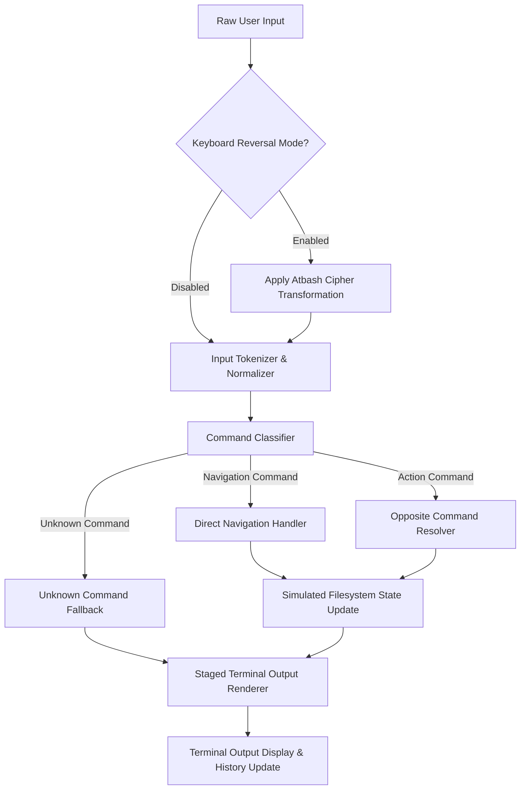

# Reverse Shell Architecture & Technical Reference

This document details the system design, data flow pipelines, and component specifications for the **Reverse Shell** web application.

---

## 1. System Pipeline & Data Flow

Every input string submitted through the terminal input prompt moves through a strictly ordered pipeline:



---

## 2. Core Modules & Component Contracts

### 2.1 Layer 1: Keyboard Reversal (`InputProcessor`)
- **Responsibility**: Transforms alphabetic characters using the Atbash cipher algorithm (`A` ↔ `Z`, `a` ↔ `z`).
- **Mode Toggle**: Can be enabled/disabled via a UI toggle or hotkey.
- **Contract**:
  ```typescript
  interface InputProcessor {
    isReversalEnabled: boolean;
    processInput(rawInput: string): string; // Applies Atbash if enabled
    toggleReversal(): boolean;
  }
  ```

### 2.2 Layer 2 & 3 Classifier (`CommandClassifier`)
- **Responsibility**: Inspects tokenized input command verb and classifies it as either `NAVIGATION`, `ACTION`, or `UNKNOWN`.
- **Contract**:
  ```typescript
  type CommandCategory = 'NAVIGATION' | 'ACTION' | 'UNKNOWN';

  interface ClassifiedCommand {
    category: CommandCategory;
    originalVerb: string;
    targetVerb?: string; // Resolved opposite verb if category === 'ACTION'
    args: string[];
  }
  ```

### 2.3 Opposite Command Resolver (`OppositeResolver`)
- **Responsibility**: Looks up the target opposite verb in the centralized registry for `ACTION` commands.
- **Contract**:
  ```typescript
  interface OppositeResolver {
    resolveOpposite(verb: string): string | null;
    isActionCommand(verb: string): boolean;
  }
  ```

### 2.4 In-Memory Filesystem (`FileSystemSimulator`)
- **Responsibility**: Maintains tree nodes representing directories and files in memory. Executes simulated CRUD operations.
- **Node Schemas**:
  ```typescript
  interface FileNode {
    type: 'file';
    name: string;
    content: string;
    isLocked: boolean;
    isHidden: boolean;
  }

  interface DirectoryNode {
    type: 'directory';
    name: string;
    children: Record<string, FileNode | DirectoryNode>;
    isLocked: boolean;
    isHidden: boolean;
  }
  ```
- **Operations**:
  - `cd(path: string): string`
  - `ls(path?: string): string[]`
  - `pwd(): string`
  - `saveFile(name: string, content?: string): void`
  - `deleteFile(name: string): void`
  - `moveNode(src: string, dest: string): void`
  - `copyNode(src: string, dest: string): void`
  - `toggleLock(name: string): boolean`
  - `toggleHide(name: string): boolean`

### 2.5 Staged Terminal Renderer (`TerminalRenderer`)
- **Responsibility**: Generates visual stage logs showing command interpretation, opposite lookup, and execution results before rendering the final status line.

---

## 3. Security & Boundary Guarantees

- **No System Shell Integration**: The application must run 100% in the client browser sandbox or pure application state.
- **No Evaluation**: Never use JavaScript `eval()` or Function constructor on user inputs.
- **No File Host System Mutators**: Do not attempt to touch OS disk storage. All file operations operate exclusively on the `FileSystemSimulator` tree instance.
