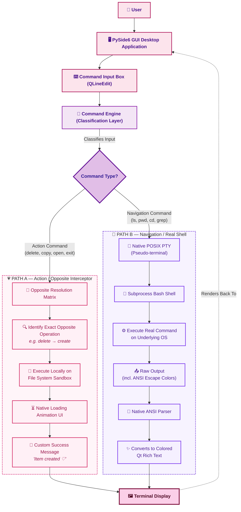

# Pookie Terminal 🎀💻
### The Terminal That Does The Opposite

A deliberately useless terminal that turns your commands into their opposites — while still being a real Linux terminal underneath.

Because apparently, normal terminals weren't confusing enough. 💀

---

## Basic Details
### College: SOE, CUSAT
### Team Name: Binary Blunder

### Team Members
- Member : Thejas V
- Member : Sreelakshmi S

---

## Project Description

Pookie Terminal is a fun, intentionally useless Linux terminal that interprets certain action commands as their opposites.

For example, `delete` becomes its opposite operation, while normal Linux commands such as `ls`, `pwd`, `cd`, `echo`, `grep`, and `find` continue to run through a real Bash shell and PTY.

---

## The Problem (that doesn't exist)

Have you ever typed a command correctly and thought:

> "What if my computer just... did the opposite?"

No?

Exactly.

Modern terminals are far too predictable. They execute what you tell them to execute, making command-line computing unnecessarily useful.

Pookie Terminal solves this completely unnecessary problem.

---

## The Solution (that nobody asked for)

We created a terminal that deliberately misunderstands you.

Certain action commands are mapped to their conceptual opposites:

| You type | Pookie thinks |
|---|---|
| `delete` | create |
| `remove` | save |
| `open` | close |
| `start` | stop |
| `copy` | move |
| `download` | upload |
| `lock` | unlock |
| `hide` | show |
| `connect` | disconnect |
| `enable` | disable |
| `compress` | expand |
| `exit` | stay |

But there's a catch:

**Normal Linux commands remain real.**

Commands such as:

```bash
ls
pwd
cd
echo
cat
grep
find
```

pass right through untouched.

## Technical Details
### Technologies/Components Used
For Software:
- **Languages used**: Python, HTML, TypeScript
- **Frameworks used**: PySide6 (Native Desktop), React + Vite + TailwindCSS (Web Prototype)
- **Libraries used**: pty (Pseudo-terminal), re (Regex ANSI parsing), Termios
- **Tools used**: WSL2, Bash

### Implementation
For Software:
# Installation
Ensure you are using a POSIX-compliant environment (like WSL on Windows, or native Linux).
```bash
# Clone the repository
git clone https://github.com/vthejas44-rgb/useless_project_temp

# Navigate into the project
cd useless_project_temp

# Install Python requirements
pip install -r terminal/requirements.txt
```

# Run
```bash
# Run the Native Desktop Terminal directly 
PYTHONPATH=. python3 -m terminal.app
```

### Web Prototype Demo
To see the conceptual web prototype:
```bash
npm install
npm run dev
```

### Project Documentation
# Screenshots
Screenshot1:https://drive.google.com/file/d/1oZvUO2x7hZ7TTP_1DM89-S2-pk342R_8/view?usp=drive_link

Screenshot2:https://drive.google.com/file/d/1ZyCMbjHLOa-WTqVykke24xP3JSmIvH5V/view

Screenshot3:https://drive.google.com/file/d/1rk2tlt1hxFpSqEhzJmO47Ax3zgwpcYa8/view


# Diagrams

*Architecture and execution flow mapping how Pookie Terminal intercepts and processes commands.* link

## Demo video link : https://drive.google.com/file/d/1rCwSDXPpi_rZvQMhZppgRwAnvENvn03Q/view?usp=drive_link

  In the demo video we have demostrated that when we try to create a file it deletes the file and when we try to delete the file it creates the file. it means that the commands we should type are opposites. We can do other things too.We have created an actual terminal due to limitations  we have demonstrated this in a video and so we have hosted a webapp of this terminal version .

## Vercel link :https://useless-project-temp-murex-theta.vercel.app/
  
## Team Contributions
- Thejas V: Implementation of PTY integration and Action Mapping architecture. UI formatting and compilation.
- Sreelakshmi S: Web Interface Prototype and UI Design.

---
Made with ❤️ at TinkerHub Useless Projects 


